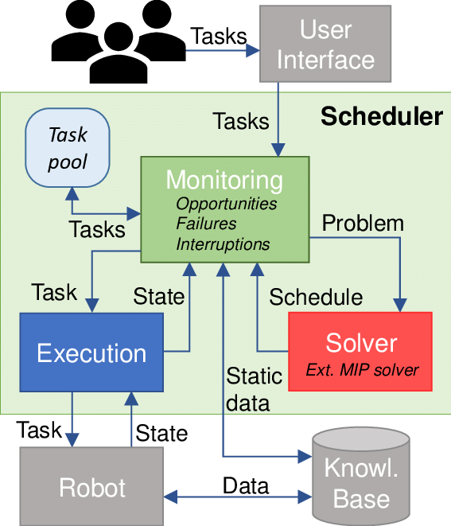
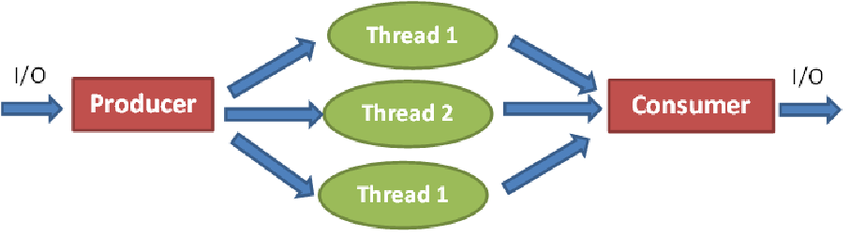

## Scalable Task Scheduler & Worker System

Java · OOP · Multithreading · Design Patterns · REST

### What This Project Is

Backend system that:
- **Accepts tasks/jobs**
- **Queues them**
- **Executes them using multiple worker threads**
- **Manages concurrency, failures, and retries**

This project is focused on **how backend systems work internally**, not just on exposing APIs.

### Architecture & Concepts

High-level scheduler and worker overview:

Threading and execution concepts:

- **Producer–Consumer Design Pattern**

  

- **Thread Pools & Worker Management**

  

### Why This Matters for Backend Roles

This project demonstrates:
- **Object-Oriented Design principles**
- **Data Structures & Algorithms use in scheduling**
- **Concurrent programming (multi-thread / worker architectures)**
- **Clean structure, separation of concerns, and testability**

It shows you can design and implement real backend internals, not just basic controllers.

### Core Java & Design Concepts

- **Java / Concurrency**
  - `Thread` and `ExecutorService`
  - Synchronization primitives
  - Thread-safe collections
  - Basic use of `volatile` and locks
  - Exception handling in concurrent code

- **OOP & Design Patterns**
  - **Factory** – task creation
  - **Strategy** – pluggable task execution logic
  - **Singleton** – central scheduler/manager
  - **Observer** – task status updates / listeners

- **Data Structures**
  - `BlockingQueue` for task queuing
  - `PriorityQueue` for priority tasks (optional)
  - `HashMap` (or similar) for task tracking and status

### Core Features

- **1️⃣ Submit Task API – `POST /tasks`**
  - Accepts a new task definition from clients.
  - Enqueues the task into an in-memory `BlockingQueue` (or priority queue).

- **2️⃣ Task Queue**
  - Central queue for pending tasks.
  - Optionally supports priority-based ordering.

- **3️⃣ Worker Pool**
  - Multiple worker threads consume from the queue.
  - Parallel task execution using `ExecutorService` or custom thread pool.

- **4️⃣ Task Status Tracking**
  - Task lifecycle states such as `PENDING`, `RUNNING`, `COMPLETED`, `FAILED`.
  - In-memory map or store for quickly retrieving status.

- **5️⃣ Graceful Shutdown**
  - Workers finish in-flight tasks before exiting.
  - No tasks are lost during shutdown.

- **6️⃣ Unit Tests**
  - Tests for scheduler and worker logic.
  - Thread-safety and basic concurrency scenarios.
  - Mock task implementations to validate behaviour.

